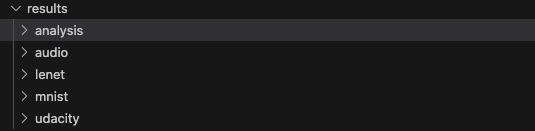
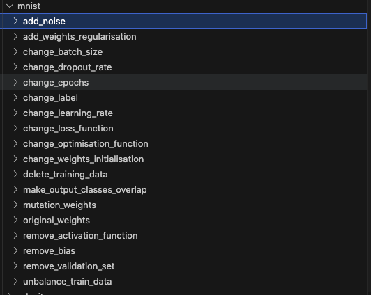
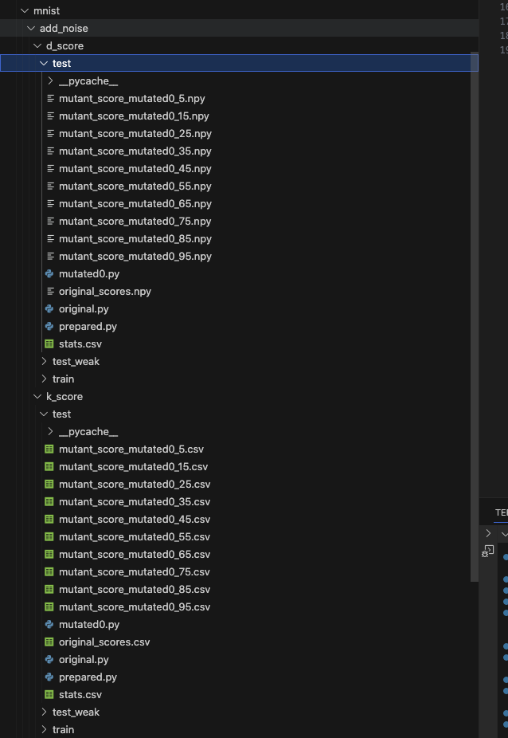
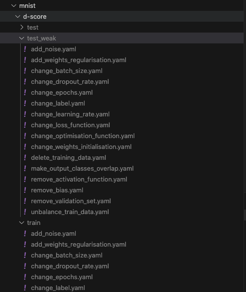

# Replication Package for "Diversity-Aware Mutation Testing for Deep Learning Systems" Dissertation Project

## Project Overview
This repository contains the replication package for the dissertation project on **Diversity-Aware Mutation Testing for Deep Learning Systems**. Below is an outline of the different deep learning subjects used in the experiments:

- **mnist**: Image Classification (MN)
- **audio**: Speaker Recognition (SR)
- **lenet**: Eye Gaze Estimation (UE)
- **udacity**: Steering Angle Prediction (SDC)

### Structure of Project
The structure of the project is as follows:

* **Folder `analyse`**: Defines how to perform the `statistical analysis` on the evaluation results and calculate the mutation scores.
* **Folder `cmd`**: The main entry point for the project.
* **Folder `config_file`**: Defines common configurations for each subject, such as the mutation operator list and the model weights save path.
* **Folder `execution`**: Contains the training scripts for model weights of the original network and the mutants.
* **Folder `mutation`**: Defines how to mutate the original network.
* **Folder `operators`**: Contains all the `mutation operators` used to mutate the original network.
* **Folder `properties`**: Defines the properties for each mutation operator, such as the configuration space of the mutation operator. Each `properties` folder contains:
  * `properties.py`: Specifies details for each mutation operator.
  * `constants.py`: Contains common configurations for every mutation operator.
* **Folder `results`**: Generated during training. This folder stores results such as the `mutated program`, `statistical results`, `evaluation results`, and more. Detailed explanations are provided in the next section.
* **Folder `scripts`**: Contains scripts to run the experiments, which simplifies running the entire experiment on HPC.
* **Folder `test_models`**: Defines the original network architecture for each subject. 
  * `DeepCrime` defines the network under the k-criterion.
  * `Diversity` defines the original network architecture under the d-criterion.
* **Folder `utils`**: Contains common utility functions used across other modules.
* **`gen_single_mutation_config.py`**: A script that generates the configuration file for a single mutation operator.


#### About `results` Directory

The `results` directory has the following structure, containing `analysis` and `$subject` folders.



- **`analysis`**: This folder contains the results for `dScore` and `kScore` of each mutation operator for every subject and dataset.
- **`$subject`**: This folder contains the intermediate results for each subject. For example, let's use the 'mnist' subject:



As seen, each mutation operator generates a folder. Additionally, there are:
- **`mutation_weights`**: Stores the model weights for the mutants.
- **`original_weights`**: Stores the model weights for the original network.

The `mutation_weights` and `original_weights` can be saved in different locations, as configured in the `save_path` in the `config_file`.

For each `mutation operator` folder (e.g., using `add_noise` as an example):



Each operator has two folders, `d_score` and `k_score`, and within them, there are `test`, `test_weak`, and `train` folders that record the results for each dataset. For example, within the `test` folder under `d_score`, there are the following files:
- **`xx.npy`**: Records the `evaluation results` for each single test case for each mutant. For instance, `mutant_score_mutated0_5.npy` records the evaluation results on the test dataset when the `add_noise` configuration is set to 5%.
- **`original_scores.npy`**: Records the `evaluation results` for each single test case for the original model.
- **`stats.csv`**: Contains the d-vector for each mutant, in the format: "mutant_name, d-vector". For example, `mutant_score_mutated0_55, [0, 0, 0, 0, 0, 0, 0, 0, 0, ..]`.

For the `k_score` folder, you will find:
- **`xx.csv`**: Records the `evaluation results` for whole test dataset for each mutant. Each line follows the format: "model_num, loss, evaluation_results". For example, `1, 0.024982170373063127, 0.992` means that model "1" has a loss of `0.024982170373063127` and an accuracy of `0.992`.
- **`original_scores.csv`**: Records the `evaluation results` for whole test dataset for  the original model.
- **`stats.csv`**: Contains the statistical results for each mutant, in the format: "mutant_name, p_value, effect_size, is_killed". For example, `mutant_score_mutated0_45, 0.32, 0.31461599362256076, 0`.

Common files in each folder include:
- **`mutated0.py`**: The mutated network program, used to train the mutant model weights.
- **`original.py`**: Used to train the original model weights.
- **`prepared.py`**: Used to generate the `original.py`.


## Setup Instructions

### Dataset Preparation
To replicate the experiments, the necessary datasets should be placed in the current directory. Datasets can be downloaded from the following link: [Download Datasets](https://zenodo.org/records/4772465). The directory structure should conform to the image below:


### Environment Setup
It is recommended to create a Python 3.8 environment using `conda` and install the required dependencies via `pip`. The `requirements38.txt` file is provided for this purpose.

1. Create and activate a conda environment:
   ```sh
   conda create --name <environment_name> python=3.8
   conda activate <environment_name>
2. Install dependencies:
    ```sh
    pip install -r requirements38.txt
    ```
### Configuration File Generation
Each subject has predefined configuration files in the `config_file` directory, covering all mutation operators. For example, `config_file/mnist/k-score` contains configuration files such as `mnist_test_weak.yaml`, `mnist_test.yaml`, and `mnist_train.yaml`.
The configuration files follow this format:

* `subject_name`: The dataset name.
* `original_path`: Path to the original program for the subject.
* `mutations`: List of mutation operators.
* `mode`: Execution mode, either test, train, or weak_test.
* `criterion`: Mutation adequacy criterion, either k_score or d_score.
* `workers_num`: Number of parallel processes for training.
* `save_path`: Path for saving model weights.

You should adjust the `save_path` and `workers_num` as per your preference.

To generate configuration files for individual mutation operators for each DL subject and each mutation adequcy criterion, use the script `gen_single_mutation_config.py`:
```sh
python gen_single_mutation_config.py
```
For example, this script will create configuration files for each mutation operator for the `mnist` dataset, as shown below:

> These configuration files for individual mutation operators are used to train the model weights for each mutation operator in parallel.


## Running Experiment
The experiments consist of several sequential steps. Below is an example using the **mnist** dataset. Ensure each step is completed before proceeding to the next. The scripts may need to be adjusted for your HPC environment (e.g., "module load" and "source activate" commands).
```sh
module load Anaconda3/2019.07 # replace them with your enviroment setting
source activate zzc_test1 
```

### Step 1: Train the Original Model Weights
This step will train the model weights for original network.

For HPC users (Slurm):
```sh
source ./scripts/mnist/mnist_original.sh
```
For non-HPC users:
```sh
export PYTHONPATH=$(pwd)
python ./cmd/main.py --config ./config_file/mnist/k-score/test/${mutation}.yaml --properties ./properties/mnist/properties.py --constants ./properties/mnist/constants.py
```
Replace `${mutation}` with a mutation operator from `mnist_mutations` in `./scripts/tasks_properties.sh`, e.g.:
```sh
python ./cmd/main.py --config ./config_file/mnist/k-score/test/change_epochs.yaml --properties ./properties/mnist/properties.py --constants ./properties/mnist/constants.py
```

### Step 2: Train all the Mutant Models
This step will train the model weights for all mutants.

For HPC users (Slurm):
```sh
source ./scripts/mnist/mnist_mutation.sh
```
This script will train model weights for each mutation operator.

For non-HPC users:
```sh
export PYTHONPATH=$(pwd)
python ./cmd/main.py --config ./config_file/mnist/k-score/test/${mutation}.yaml --properties ./properties/mnist/properties.py --constants ./properties/mnist/constants.py
```
Replace `${mutation}` with a mutation operator from `mnist_mutations` in `./scripts/tasks_properties.sh`. To obtain all the model weights for the mutants, this command needs to be repeatedly executed to train the model weights under all mutation operators.


### Step 3: Evaluate the Mutant Models on Datasets
To evaluate the trained models on different datasets (`test`, `test_weak`, `train`) under various mutation adequacy criteria(`k-crterion`, `d-criterion`):

For HPC users (Slurm):
```sh
source ./scripts/mnist/${criterion}/mnist_${data_type}.sh
```
* `${criterion}`: `k-score`, `d-score`
* `${data_type}`: `test`, `test_weak`, `train`


For non-HPC users:
```sh
export PYTHONPATH=$(pwd)
python ./cmd/main.py --config ./config_file/mnist/{criterion}/`${data_type}/${mutation}.yaml --properties ./properties/mnist/properties.py --constants ./properties/mnist/constants.py
```
* `${criterion}`: `k-score`, `d-score`
* `${data_type}`: `test`, `test_weak`, `train`
* `${mutation}`: choose from `mnist_mutations` in `./scripts/tasks_properties.sh`


### Step 4: Statistical Analysis
After obtaining all the evaluation results for the original network and each mutant, use statistical analysis to calculate the `effect_size` and `p_value`  for the original and mutated models:

For HPC users (Slurm):
```sh
source ./scripts/stats.sh
```
This scirpt will do the `Statistical Analysis` for all subjects

For non-HPC users:
```sh
export PYTHONPATH=$(pwd)
python ./analyse/stats_analysis.py --config ./config_file/${task}/${criterion}/${mode}/${mutation}.yaml --model_type $model_type --statistical_test $statistical_test
```
* `${task}`: "mnist" "movie" "audio" "udacity"  "lenet"
* `${criterion}`: "k-score" "d-score"
* `${mode}`: "test" "train" "test_weak"
* `${mutation}`: choose from `mnist_mutations` in `./scripts/tasks_properties.sh`

### Step 5: Calculate Mutation Scores
After obtaining all the results from the statistical analysis, you can then calculate the mutation score under different criteria for all subjects.

For all users:
```sh
python ./analyse/muation_scores.py
```
It will calculate all the mutation scores for each mutation operator of each DL subject under two mutation criteria.

## Credits
This project includes contributions from the following source:

- **Replication package for the "DeepCrime: Mutation Testing of Deep Learning Systems based on Real Faults" paper**
  - Authors: Nargiz Humbatova, Gunel Jahangirova, & Paolo Tonella
  - Conference: ACM SIGSOFT International Symposium on Software Testing and Analysis (ISSTA), Aarhus, Denmark
  - Source: [Zenodo](https://zenodo.org/records/4772465)
  - DOI: [10.5281/zenodo.4772465](https://doi.org/10.5281/zenodo.4772465)
  - License: Creative Commons Attribution 4.0 International
