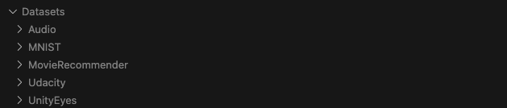

## Project Setup and Instructions
### Datasets Preparation
To start the experiments, you need to prepare the datasets in the current directory. The datasets can be downloaded from the following link: Download Datasets. The structure of the datasets should be as shown in the image below:


### Environment Setup
It is recommended to use conda to create a Python 3.8 environment and then use pip to install the required dependencies. The required environment can be set up using the `requirements38.txt` file provided.
1. Create and activate the conda environment:
```sh
conda create --name your_environment_name python=3.8
conda activate your_environment_name
```
2. Install the required dependencies using pip:

```sh
pip install -r requirements38.txt
```
### Running Experiments
Using Movie Dataset as an Example

#### For HPC Users (Slurm)
Use the scripts in the `./scripts` directory. For example, to train the models and mutants under k-score using the test suite
1.  Update your `movie_test.sh` script to load the appropriate Anaconda module and activate your conda environment. 
2. you can use the following command:
```
sbatch ./scripts/movie/k-score/movie_test.sh
```


#### For Non-HPC Users
1. Activate your environment:
```sh
export PYTHONPATH=$(pwd)
conda activate your_environment_name
```
2. Use the following command to run the experiment:
```sh
python ./cmd/main.py --config ./config_file/movie/k-score/movie_test.yaml --properties ./properties/movie/properties.py --constants ./properties/movie/constants.py
```

### Configuration Files

#### config_file

In the `config_file`, you can change the configuration of basic information of the task

* subject_name: The dataset name.
* original_path: The original program of the `subject` code.
* mutations: List of mutation operators.
* mode: Can be `test`, `train`, or `weak_test`.
* criterion: Can be `k_score` or `d_score`.
* workers_num: The number of processes to train the models.
* save_path: The path where you can save your model weights.

#### properties and constants
These files contain configurations for the mutation operators. Adjust these settings as needed for your experiments.

## Credits
This project includes contributions from the following source:

- **Replication package for the "DeepCrime: Mutation Testing of Deep Learning Systems based on Real Faults" paper**
  - Authors: Nargiz Humbatova, Gunel Jahangirova, & Paolo Tonella
  - Conference: ACM SIGSOFT International Symposium on Software Testing and Analysis (ISSTA), Aarhus, Denmark
  - Source: [Zenodo](https://zenodo.org/records/4772465)
  - DOI: [10.5281/zenodo.4772465](https://doi.org/10.5281/zenodo.4772465)
  - License: Creative Commons Attribution 4.0 International